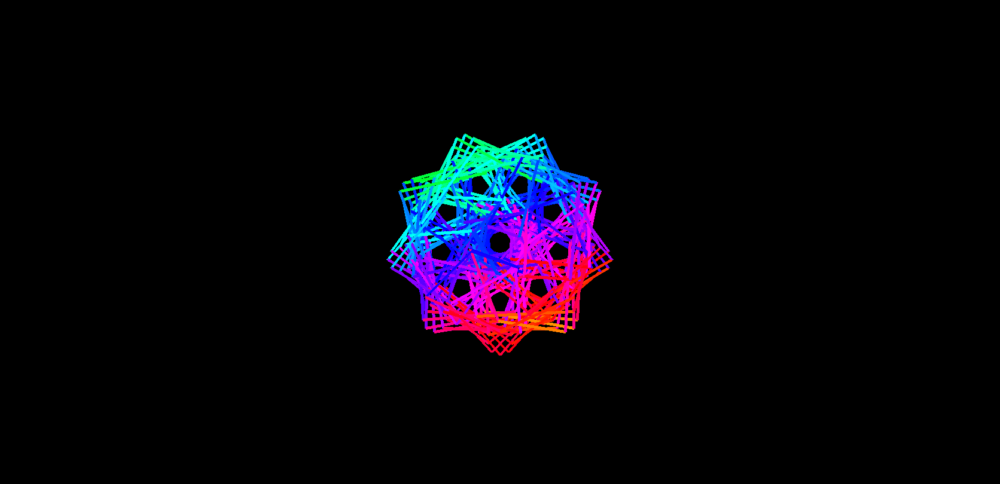
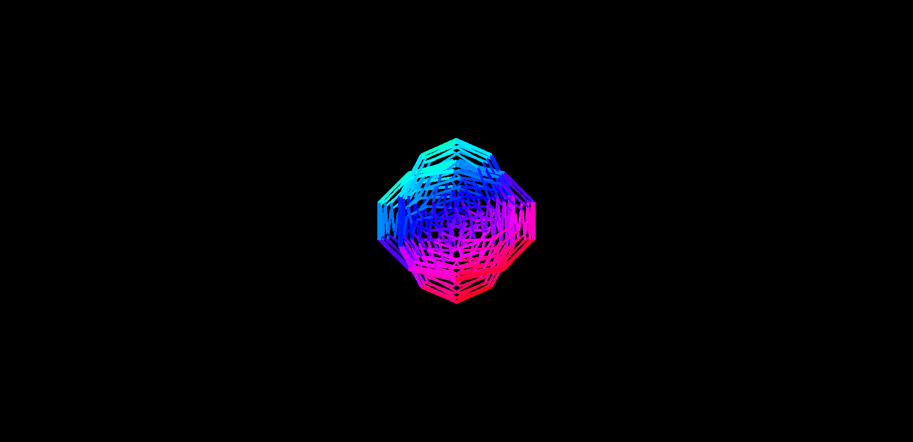
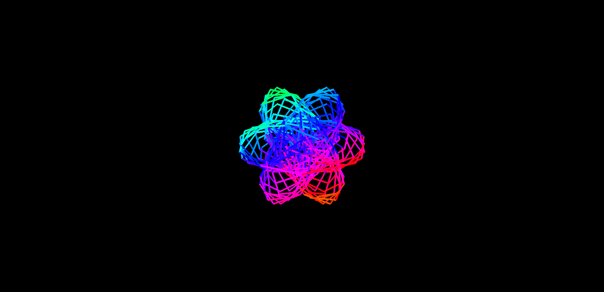
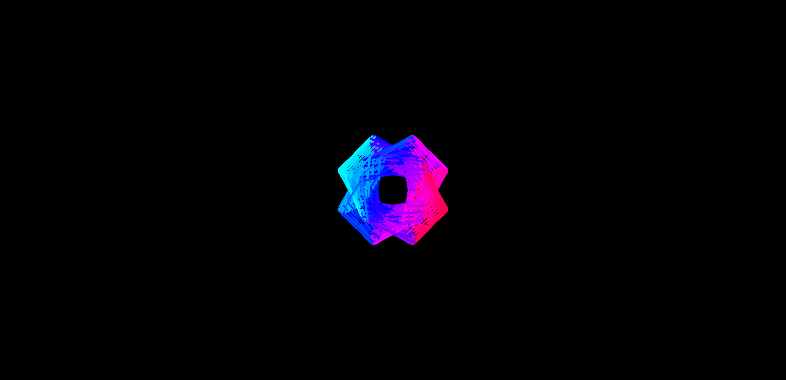

Certainly, here's a README file template for an abstract logo generation project. You can customize and expand upon this template to provide detailed instructions and information about your project.

---

# Abstract Logo Generator



## Table of Contents

- [Introduction](#introduction)
- [Features](#features)
- [Installation](#installation)
- [Usage](#usage)
- [Customization](#customization)
- [Examples](#examples)
- [Contributing](#contributing)
- [License](#license)

## Introduction

The Abstract Logo Generator is a Python-based project that allows you to create abstract shapes and designs on a graphical canvas. This tool is suitable for artists, designers, or anyone interested in generating abstract art programmatically.



## Features

- **Random Shape Generation:** Create abstract shapes with random parameters like speed, length, and range.
- **Drawing and Animation:** Draw shapes on the canvas with customizable speed and length parameters. Enable rainbow mode for colorful animations.
- **Save and Load:** Save and load shape coordinates to/from a file for reuse.
- **Color Control:** Choose between rainbow colors or customize the color palette for your designs.

## Installation

1. Clone this repository to your local machine:

   ```bash
   git clone https://github.com/We1337/AbstractLogo.git
   ```

2. Install the required dependencies:

   ```bash
   pip install pygame
   ```

## Usage

To use the Abstract Logo Generator, follow these steps:

1. Run the `main.py` script:

   ```bash
   python main.py
   ```

2. Use the provided interface to control the logo generation. You can choose to create random shapes, draw shapes, or animate with rainbow colors.

3. Customize the parameters like speed, length, and range to create unique designs.

4. Save your favorite shapes and load them later for further editing.

5. Experiment with different color options to make your abstract logos visually appealing.

## Customization

You can customize the Abstract Logo Generator by:

- Modifying the default colors in the `Colors.py` file.
- Adjusting the coordinate functions in the `Coordinate.py` file.
- Adding new features or shape types to the generator.

## Examples

Here are some examples of abstract logos created using the Abstract Logo Generator:





## Contributing

We welcome contributions from the community. If you'd like to contribute to this project, please follow these guidelines:

1. Fork the repository.

2. Create a new branch for your feature or bug fix.

3. Make your changes and test them thoroughly.

4. Create a pull request to submit your changes.

5. Ensure your code follows the project's coding style and conventions.

## License

This project is licensed under the GNU License. See the [LICENSE](LICENSE) file for details.

---

Feel free to modify and enhance this README to suit your project's specific needs. Provide clear instructions and examples to help users understand and use your Abstract Logo Generator effectively.